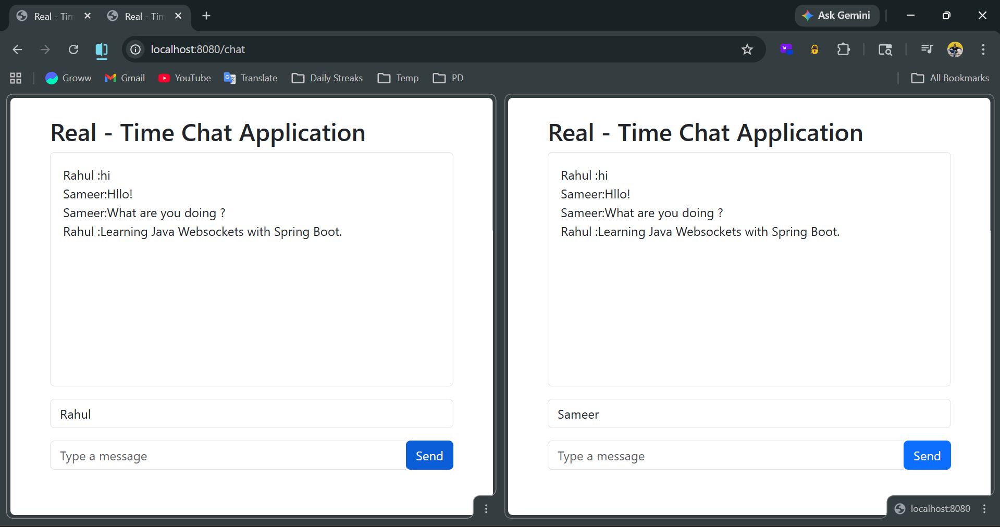

# 💬 Real-Time Chat Application

A real-time chat application built using **Spring Boot** on the backend and **WebSocket + STOMP + SockJS** on the frontend.

## 🚀 Features
- Real-time messaging using WebSocket
- Multiple users can chat simultaneously
- Clean and simple UI with Bootstrap

## 📸 Screenshot



## 🛠️ Tech Stack

### Backend (Server-Side)
| Technology | Purpose |
|-----------|---------|
| Spring Boot | Core framework |
| Spring WebSocket | WebSocket support |
| Spring Messaging | STOMP Protocol |
| Thymeleaf | Server-side templating |

### Frontend (Client-Side)
| Technology | Purpose |
|-----------|---------|
| Thymeleaf | Template rendering |
| JavaScript (ES6) | Client-side logic |
| SockJS | WebSocket fallback |
| STOMP.js | Messaging protocol |
| HTML/CSS | Structure & styling |
| Bootstrap | UI components |

### Development & Infrastructure
| Technology | Purpose |
|-----------|---------|
| Maven/Gradle | Build tool |

## ▶️ How to Run

1. Clone the repository
   git clone https://github.com/your-username/realtime-chat-app.git

2. Open in IntelliJ IDEA

3. Run the Spring Boot application

4. Open browser and go to
   http://localhost:8080/chat

## 📁 Project Structure
```
src/
├── main/
│   ├── java/com/chat/app/
│   │   ├── config/
│   │   │   └── WebSocketConfig.java
│   │   ├── controller/
│   │   │   └── ChatController.java
│   │   └── model/
│   │       └── ChatMessage.java
│   └── resources/
│       └── templates/
│           └── chat.html
```          └── chat.html

## 👨‍💻 Author
Rahul Raushan